<h2>TensorFlow-FlexUNet-Tiled-Image-Segmentation-Penobscot-Seismic-Interpretation (2026/01/02)</h2>
Toshiyuki Arai 
Software Laboratory antillia.com  
This is the first experiment of Image Segmentation for <b>Penobscot</b> based on our <a href="./src/TensorFlowFlexUNet.py">TensorFlowFlexUNet</a> 
(TensorFlow Flexible UNet Image Segmentation Model for Multiclass) , 
and a 512x512 pixels 
<a href="https://drive.google.com/file/d/1Y4n8W9viYiXYsG8wwbMYEZf-LBjNMKZ4/view?usp=sharing">
<b>Tiled-Penobscot-ImageMask-Dataset.zip</b></a> which was derived by us from   
<a href="https://zenodo.org/records/3924682/files/dataset.h5?download=1"><b>dataset.h5</b> </a> in 
<a href="https://zenodo.org/records/3924682">
<b>Penobscot Interpretation Dataset</b> </a> on zenodo.org.
  
<b>Divide-and-Conquer Strategy</b> 
In this experiment with the TensorFlowFlexUNet segmentation model, 
since the images and masks in the training dataset are slightly large (481x1501 pixels),
we adopted the following <b>Divide-and-Conquer Strategy</b> for building the segmentation model.
  
<b>1. Augmented-Tiled Image and Colorized Mask Dataset</b> 
We generated an Upscaled PNG image and colorized mask datasets of 512x1536 pixels from the original <b>dataset.h5</b>
, and then generated a 512x512 pixels tiledly-split dataset from  the Upscaled one. 
<b>2. Train Model by Tiled ImageMask Dataset</b> 
We trained and validated the TensorFlowFlexUNet model by using the Tiled-Penobscot-ImageMask-Dataset.
 
<b>3. Tiled Image Segmentation</b> 
We applied our Tiled-Image Segmentation inference method to predict facies regioins 
 for the mini_test images with a resolution of 512x1536 pixels.  

<b>Actual Image Segmentation for Penobscot Images of 512x1536 pixels </b> 
As shown below, the inferred masks predicted by our segmentation model trained by the dataset appear similar to the ground truth masks
, but lack precision in some areas.
  
<a href="#color-class-mapping-table">Color class mapping table</a>
 
<table border=1 style='border-collapse:collapse;' cellpadding='5'>
<tr>
<th>Input: image</th>
<th>Mask (ground_truth)</th>
<th>Prediction: inferred_mask</th>
</tr>
<tr>
<td></td>
<td></td>
<td></td>
</tr>

<tr>
<td>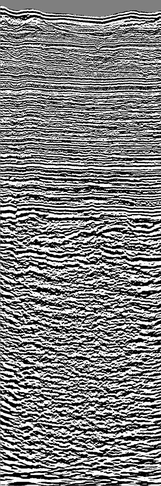</td>
<td></td>
<td></td>
</tr>
<!--
<tr>
<td>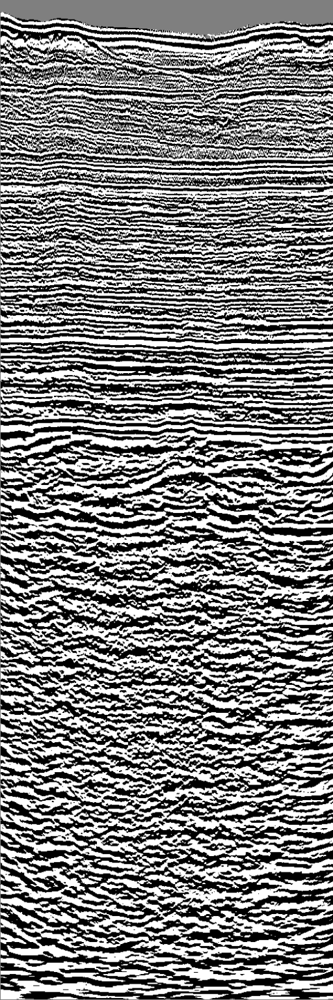</td>
<td></td>
<td></td>
</tr>
 -->
</table>

 
<h3>1  Dataset Citation</h3>
The dataset used here was derived from   
<a href="https://zenodo.org/records/3924682/files/dataset.h5?download=1"><b>dataset.h5</b> </a> in 
<a href="https://zenodo.org/records/3924682">
<b>Penobscot Interpretation Dataset</b> </a> on zenodo.org.
  
Baroni, Lais; Silva, Reinaldo Mozart; S. Ferreira, Rodrigo; Chevitarese, Daniel, Szwarcman, Daniela; Vital Brazil, Emilio
  
We have seen in the past years the flourishing of machine and deep learning algorithms in several applications such as image classification and segmentation, 
object detection and recognition, among many others. This was only possible, in part, because datasets like ImageNet - with +14 million 
labeled images - were created and made publicly available, providing researches with a common ground to compare their advances and extend the state-of-the-art. 
 Although we have seen an increasing interest in machine learning in geosciences as well, we will only be able to achieve a significant impact in our community 
 if we collaborate to build such a common basis. This is even more difficult when it comes to the Oil & Gas industry, in which confidentiality and 
 commercial interests often hinder the sharing of datasets to others. In this letter, we present the Penobscot interpretation dataset, 
 our contribution to the development of machine learning in geosciences, more specifically in seismic interpretation.  
 The Penobscot 3D seismic dataset was acquired in the Scotian shelf, offshore Nova Scotia, Canada. The data is publicly available and 
 comprises pre- and pos-stack data, 5 horizons and well logs of 2 wells. However, for the dataset to be of practical use for our tasks, 
 we had to reinterpret the seismic, generating 7 horizons separating different seismic facies intervals. 
 The interpreted horizons were used to generated +100,000 labeled images for inlines and crosslines. 
To demonstrate the utility of our dataset, results of two experiments are presented.
  
<b>Citation</b> 
Baroni, L., Silva, R. M., S. Ferreira, R., Chevitarese, D., Szwarcman, D., & Vital Brazil, E.  
(2020). Penobscot Interpretation Dataset (3.0.0) [Data set].  
Zenodo. https://doi.org/10.5281/zenodo.3924682
 
 
<b>License</b> 
<a href="https://creativecommons.org/licenses/by/4.0/legalcode">Creative Commons Attribution 4.0 International</a>
 
 
<h3>
2 Penobscot ImageMask Dataset
</h3>
 If you would like to train this Penobscot Segmentation model by yourself,
please down load our dataset <a href="https://drive.google.com/file/d/1Y4n8W9viYiXYsG8wwbMYEZf-LBjNMKZ4/view?usp=sharing">
<b>Tiled-Penobscot-ImageMask-Dataset.zip</b>
</a> on the google drive,
expand the downloaded , and put it under <b>./dataset/</b> to be.
<pre>
./dataset
└─Penobscot
    ├─test
    │   ├─images
    │   └─masks
    ├─train
    │   ├─images
    │   └─masks
    └─valid
        ├─images
        └─masks
</pre>
 
<b>Penobscot Statistics</b> 
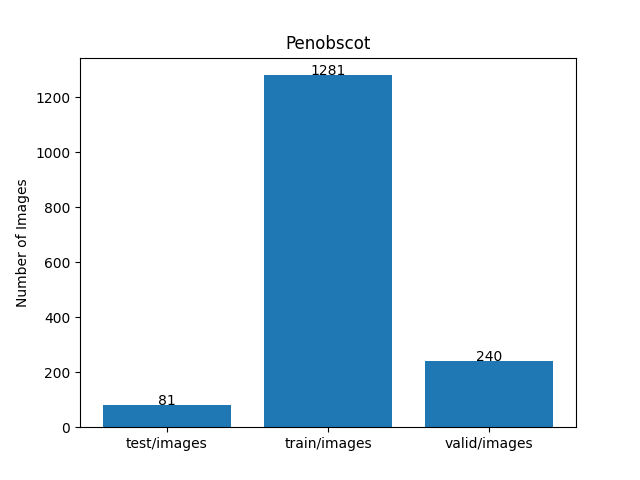 
 
As shown above, the number of images of train and valid datasets is not enough to use for a training set of our segmentation model.
  
We also used the following color-class-mapping table to generate our colorized masks and define a rgb_map for our mask format
between indexed colors and rgb_colors. 
 
<a id="color-class-mapping-table"><b>Seismic Facies color class mapping table</b></a>

<table border=1 style='border-collapse:collapse;' cellpadding='5'>
<tr><th>Indexed Color</th><th>Color</th><th>RGB</th><th>Class</th></tr>
<tr><td>0</td><td with='80' height='auto'></td><td>(0, 0, 0)</td><td>Class0</td></tr>
<tr><td>1</td><td with='80' height='auto'></td><td>(20, 70, 245)</td><td>Class1</td></tr>
<tr><td>2</td><td with='80' height='auto'></td><td>(40, 90, 235)</td><td>Class2</td></tr>
<tr><td>3</td><td with='80' height='auto'></td><td>(60, 110, 225)</td><td>Class3</td></tr>
<tr><td>4</td><td with='80' height='auto'></td><td>(80, 130, 215)</td><td>Class4</td></tr>
<tr><td>5</td><td with='80' height='auto'></td><td>(100, 150, 205)</td><td>Class5</td></tr>
<tr><td>6</td><td with='80' height='auto'></td><td>(120, 170, 195)</td><td>Class6</td></tr>
<tr><td>7</td><td with='80' height='auto'></td><td>(140, 190, 185)</td><td>Class7</td></tr>
</table>
 
<b>Train_images_sample</b> 
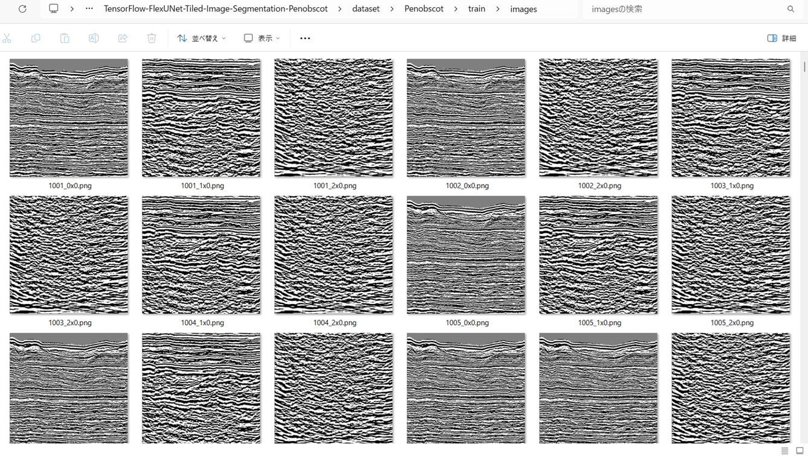
 
<b>Train_masks_sample</b> 
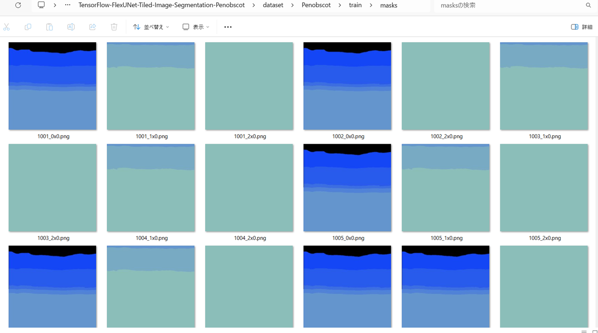
 
<h3>
3 Train TensorflowFlexUNet Model
</h3>
 We trained Penobscot TensorflowFlexUNet Model by using the following
<a href="./projects/TensorFlowFlexUNet/Penobscot/train_eval_infer.config"> <b>train_eval_infer.config</b></a> file.  
Please move to ./projects/TensorFlowFlexUNet/Penobscot and run the following bat file. 
<pre>
>1.train.bat
</pre>
, which simply runs the following command. 
<pre>
>python ../../../src/TensorFlowFlexUNetTrainer.py ./train_eval_infer.config
</pre>

<b>Model parameters</b> 
Defined a small <b>base_filters=16</b> and a large <b>base_kernels=(11,11)</b> for the first Conv Layer of Encoder Block of 
<a href="./src/TensorflowUNet.py">TensorflowUNet.py</a> 
and a large num_layers (including a bridge between Encoder and Decoder Blocks).
<pre>
[model]
image_width    = 512
image_height   = 512
image_channels = 3
input_normalize = True
normalization  = False

num_classes    = 8

base_filters   = 16
base_kernels  = (11,11)
num_layers    = 8

dropout_rate   = 0.05
dilation       = (1,1)
</pre>

<b>Learning rate</b> 
Defined a small learning rate.  
<pre>
[model]
learning_rate  = 0.00007
</pre>

<b>Loss and metrics functions</b> 
Specified "categorical_crossentropy" and "dice_coef_multiclass". 
<pre>
[model]
loss           = "categorical_crossentropy"
metrics        = ["dice_coef_multiclass"]
</pre>
<b >Learning rate reducer callback</b> 
Enabled learing_rate_reducer callback, and a small reducer_patience.
<pre> 
[train]
learning_rate_reducer = True
reducer_factor     = 0.5
reducer_patience   = 4
</pre>
<b>Early stopping callback</b> 
Enabled early stopping callback with patience parameter.
<pre>
[train]
patience      = 10
</pre>
<b></b> 
<b>RGB color map</b> 
rgb color map dict for Penobscot 8 classes. 
<a href="#color-class-mapping-table">Color class mapping table</a>
<pre>
[mask]
mask_file_format = ".png"
;Penobscot 8
rgb_map={(0,0,0):0,(20,70,245):1,(40,90,235):2,(60,110,225):3,(80,130,215):4,(100,150,205):5,(120,170,195):6,(140,190,185):7,}
</pre>
<b>Epoch change inference callbacks</b> 
Enabled epoch_change_infer callback. 
<pre>
[train]
epoch_change_infer     = False
epoch_change_infer_dir =  "./epoch_change_infer"
epoch_change_tiled_infer     = True
epoch_change_tiled_infer_dir =  "./epoch_change_tiled_infer"
</pre>
By using this epoch_change_tiled_infer callback, on every epoch_change, the inference procedure can be called
 for 6 images in <b>mini_test</b> folder. This will help you confirm how the predicted mask changes 
 at each epoch during your training process.    
<b>Epoch_change_inference output at starting (1,2,3)</b> 
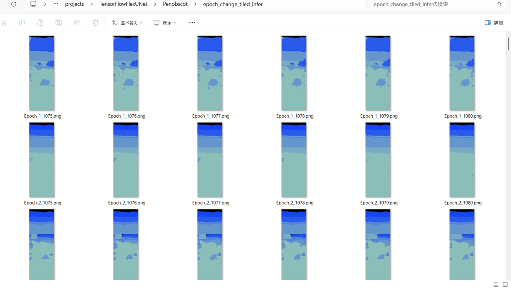 
 
<b>Epoch_change_inference output at ending (28,29,30)</b> 
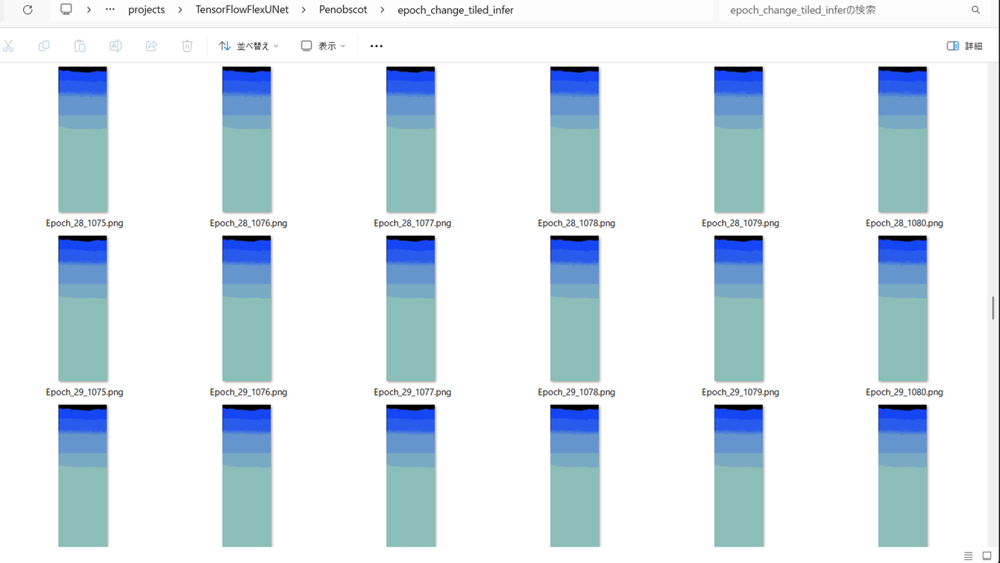 
 
<b>Epoch_change_inference output at ending (58,59,60)</b> 
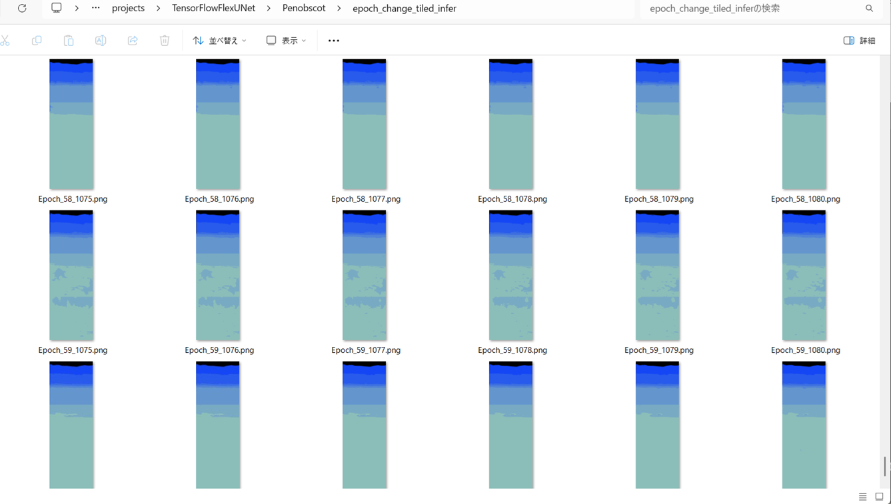 

 
In this experiment, the training process was terminated at epoch 60.  
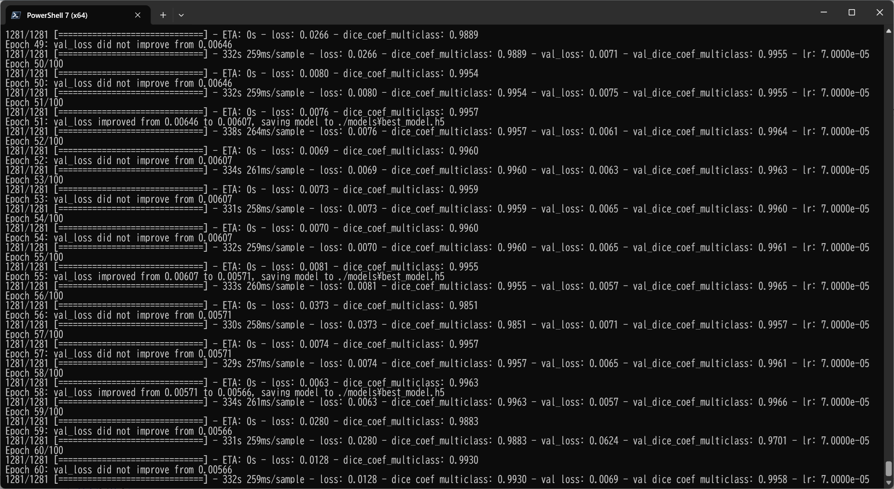 
 
<a href="./projects/TensorFlowFlexUNet/Penobscot/eval/train_metrics.csv">train_metrics.csv</a> 
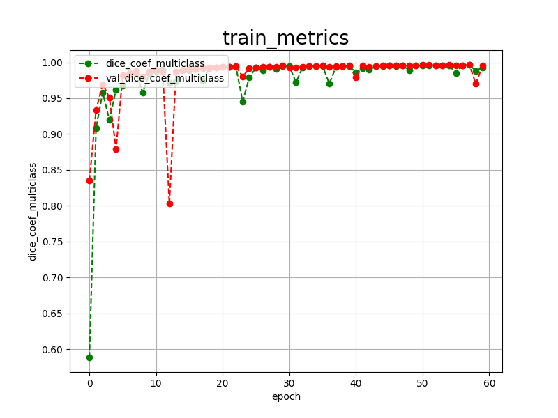 

 
<a href="./projects/TensorFlowFlexUNet/Penobscot/eval/train_losses.csv">train_losses.csv</a> 
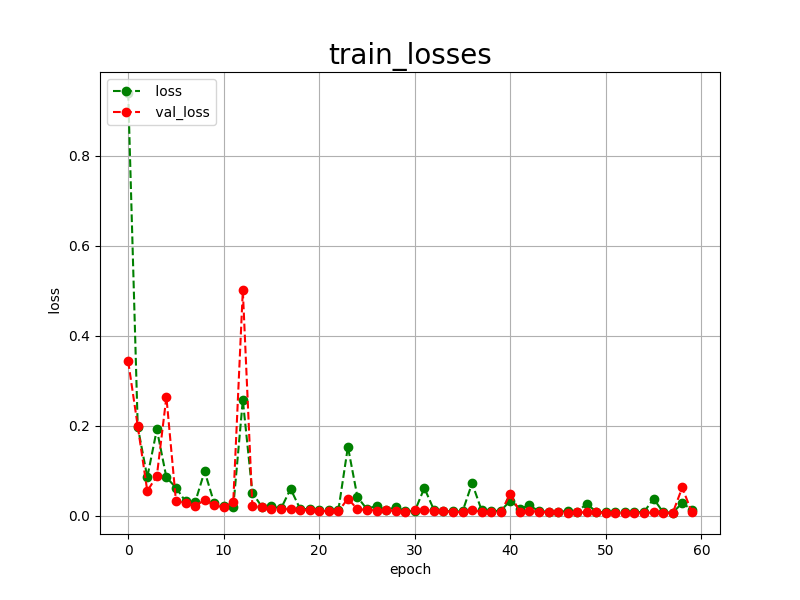 
 
<h3>
4 Evaluation
</h3>
Please move to a <b>./projects/TensorFlowFlexUNet/Penobscot</b> folder, 
and run the following bat file to evaluate TensorflowFlexUNet model for Penobscot. 
<pre>
>./2.evaluate.bat
</pre>
This bat file simply runs the following command.
<pre>
>python ../../../src/TensorFlowFlexUNetEvaluator.py  ./train_eval_infer.config
</pre>
Evaluation console output: 
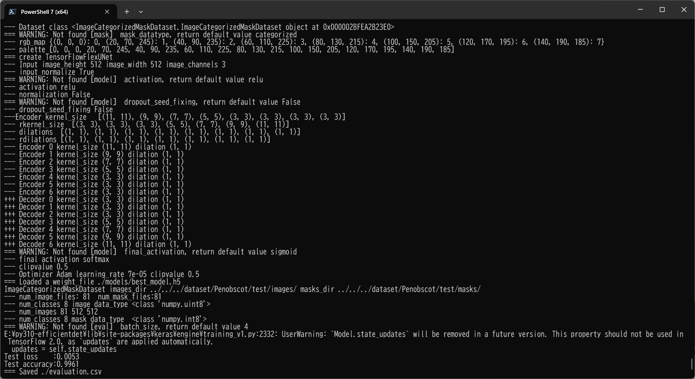
  Image-Segmentation-Penobscot

<a href="./projects/TensorFlowFlexUNet/Penobscot/evaluation.csv">evaluation.csv</a> 
The loss (categorical_crossentropy) to this Penobscot/test was low, and dice_coef_multiclass  high as shown below.
 
<pre>
categorical_crossentropy,0.0053
dice_coef_multiclass,0.9961
</pre>
 
<h3>5 Inference</h3>
Please move to a <b>./projects/TensorFlowFlexUNet/Penobscot</b> folder 
,and run the following bat file to infer segmentation regions for images by the Trained-TensorflowFlexUNet model for Penobscot. 
<pre>
>./4.infer.bat
</pre>
This simply runs the following command.
<pre>
>python ../../../src/TensorFlowFlexUNetTiledInferencer.py ./train_eval_infer.config
</pre>

<b>mini_test_images</b> 
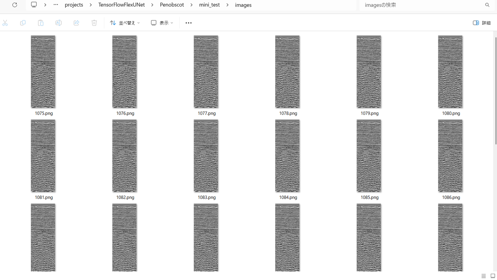 
<b>mini_test_mask(ground_truth)</b> 
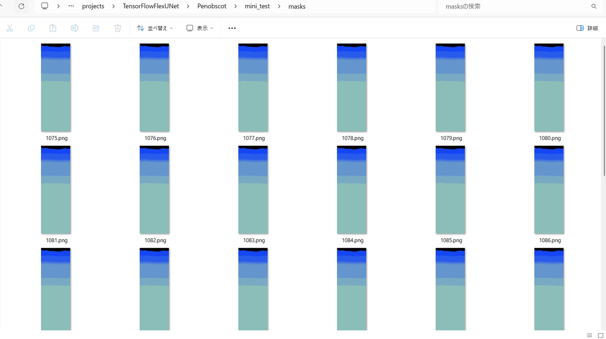 

<b>Inferred test masks</b> 
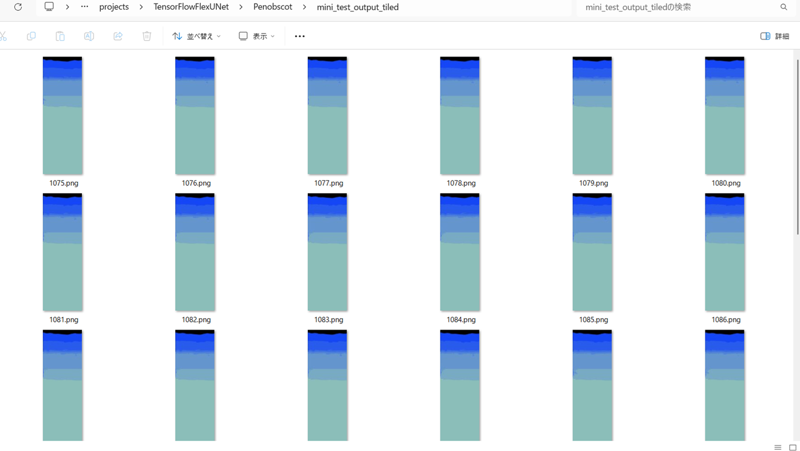 
 

<b>Enlarged images and masks for  Penobscot  Images of 512x1536 pixels</b> 
As shown below, the inferred masks predicted by our segmentation model trained by the dataset appear similar to the ground truth masks
, but lack precision in some areas.
 
 
<a href="#color-class-mapping-table">Color class mapping table</a>
 
<table border=1 style='border-collapse:collapse;' cellpadding='5'>
<tr>
<th>Input: image</th>
<th>Mask (ground_truth)</th>
<th>Prediction: inferred_mask</th>
</tr>
<tr>
<td>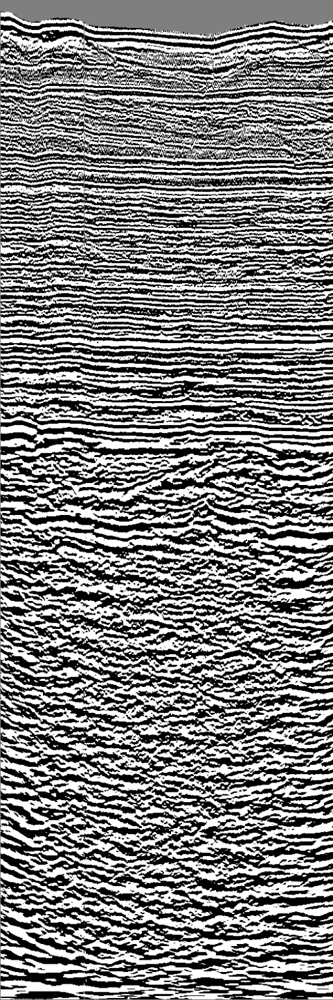</td>
<td></td>
<td></td>
</tr>

<tr>
<td>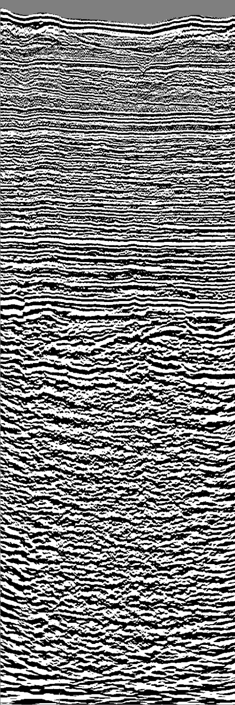</td>
<td></td>
<td></td>
</tr>

<tr>
<td>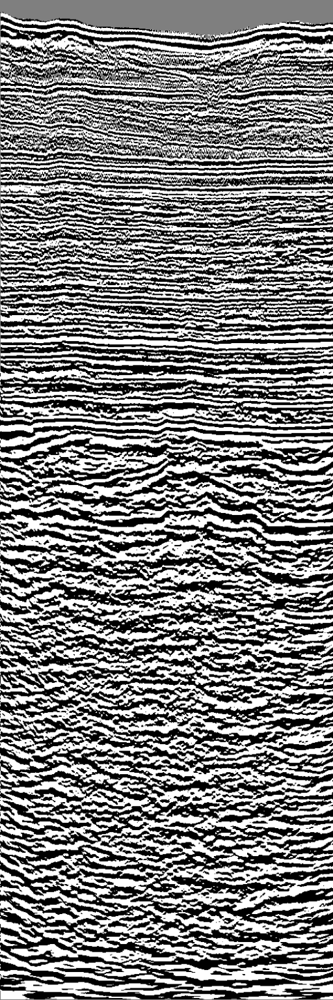</td>
<td></td>
<td></td>
</tr>
<!--

<tr>
<td></td>
<td></td>
<td>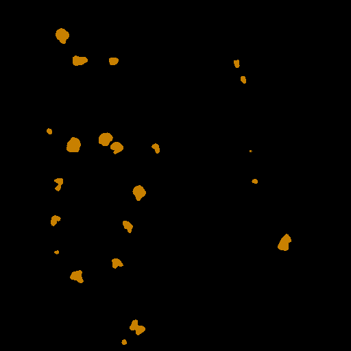</td>
</tr>
<tr>
<td></td>
<td></td>
<td>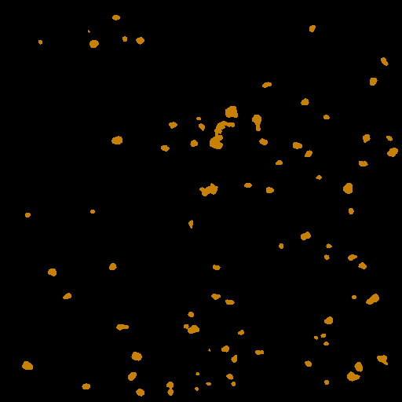</td>
</tr>
<tr>
<td></td>
<td></td>
<td>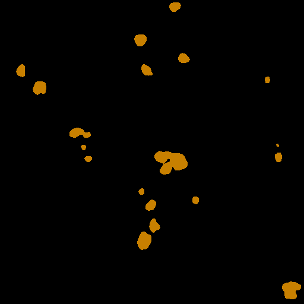</td>
</tr>
-->
</table>

 
<h3>
References
</h3>
<b>1. facies_classification_benchmark</b> 
Yazeed Alaudaha 
<a href="https://github.com/yalaudah/facies_classification_benchmark">https://github.com/yalaudah/facies_classification_benchmark</a>
 
 
<b>2. A Machine Learning Benchmark for Facies Classification</b> 
Yazeed Alaudah, Patrycja Micha lowicz, Motaz Alfarraj 
<a href="https://arxiv.org/pdf/1901.07659">
https://arxiv.org/pdf/1901.07659</a>
 
 
<b>3. Toward User-Guided Seismic Facies Interpretation With a Pre-Trained Large Vision Model</b> 
Joshua Atolagbe, Ardiansyah Koeshidayatullah 
<a href="https://ieeexplore.ieee.org/document/10909446">
https://ieeexplore.ieee.org/document/10909446
</a>
 
 
<b>4. Netherlands Dataset: A New Public Dataset for Machine Learning in Seismic Interpretation</b> 
Reinaldo Mozart Silva, Lais Baroni, Rodrigo S. Ferreira1, Daniel Civitarese, 
Daniela Szwarcman, Emilio Vital Brazil 
<a href="https://arxiv.org/pdf/1904.00770">
https://arxiv.org/pdf/1904.00770
</a>
 
 
<b>5. Penobscot Dataset: Fostering Machine Learning Development for
Seismic Interpretation</b> 
Lais Baroni, Reinaldo Mozart Silva, Rodrigo S. Ferreira, Daniel Civitarese, Daniela Szwarcman, Emilio Vital Brazil 
<a href="https://arxiv.org/pdf/1903.12060">
https://arxiv.org/pdf/1903.12060
</a>
 
 
<b>6. Semantic Segmentation of Seismic Images</b> 
Daniel Civitarese, Daniela Szwarcman,  Emilio Vital Brazil, and Bianca Zadrozny 
<a href="https://ar5iv.labs.arxiv.org/html/1905.04307">
https://ar5iv.labs.arxiv.org/html/1905.04307
</a>
 
 

<b>7. TensorFlow-FlexUNet-Image-Segmentation-Model</b> 
Toshiyuki Arai  
<a href="https://github.com/sarah-antillia/TensorFlow-FlexUNet-Image-Segmentation-Model">
https://github.com/sarah-antillia/TensorFlow-FlexUNet-Image-Segmentation-Model
</a>
 
 
<b>8. TensorFlow-FlexUNet-Image-Segmentation-Facies</b> 
Toshiyuki Arai 
<a href="https://github.com/atlan-antillia/TensorFlow-FlexUNet-Image-Segmentation-Facies">
https://github.com/atlan-antillia/TensorFlow-FlexUNet-Image-Segmentation-Facies
</a>
 
 
<b>9. TensorFlow-FlexUNet-Image-Segmentation-Netherland-F3-Interpretation</b> 
Toshiyuki Arai  
<a href="https://github.com/atlan-antillia/TensorFlow-FlexUNet-Image-Segmentation-Netherland-F3-Interpretation">
https://github.com/atlan-antillia/TensorFlow-FlexUNet-Image-Segmentation-Netherland-F3-Interpretation
</a>
 
 
